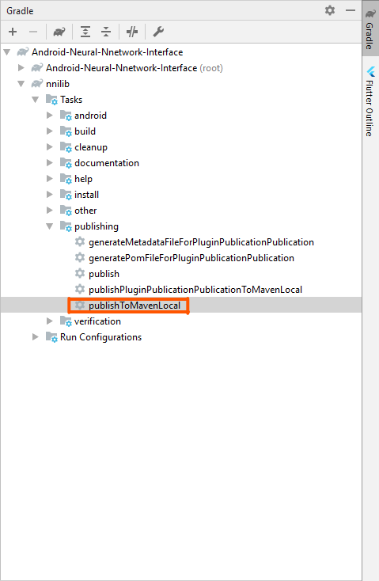

# Android Neural Nnetwork Interface (NNI)

NNI is a library which makes using neural networks in android is easier.

NNI consists of several parts:

* [Simple Network](https://github.com/KessoPavel/Android-Neural-Nnetwork-Interface/tree/master/example/SimpleNetworkExample)
* [Image Classifier](https://github.com/KessoPavel/Android-Neural-Nnetwork-Interface/tree/master/example/ImageClassifierExample)

## Using

Currently only available from the local maven repository.

### Install to maven local

#### 1. Clone this repositoty

` git clone https://github.com/KessoPavel/Android-Neural-Nnetwork-Interface.git `

#### 2. Open project in AndroidStudio

#### 3. Install to maven local

In the gradle tab, select the nnilib project -> tasks -> publishing -> publishToMavenLocal



### Add dependency to android project

#### 1. Add mavenLocal to project repositories

Configure your project to use the local maven repository by adding mavenLocal() to the repositories in your project’s build.gradle.

```
repositories {
    ...
    mavenLocal()
}
```

Adding NNI to the your project’s dependencies.

```
dependencies {
    classpath 'com.kesso:nni:1.0'
    ...
}
```

The build.gradle of your project should look something like this

```
buildscript {
    ext.kotlin_version = '1.3.21'
    repositories {
        google()
        jcenter()
        mavenLocal()
    }
    dependencies {
        classpath 'com.kesso:nni:1.0'
        classpath 'com.android.tools.build:gradle:3.5.0'
        classpath "org.jetbrains.kotlin:kotlin-gradle-plugin:$kotlin_version"
    }
}
```

#### 2. Add NNI to module dependenciesde

In order to use nni librari, you will have to add dependency on them in the app/build.gradle file, like follow:

```
dependencies {
    implementation 'com.kesso:nni:1.0'
}
```
